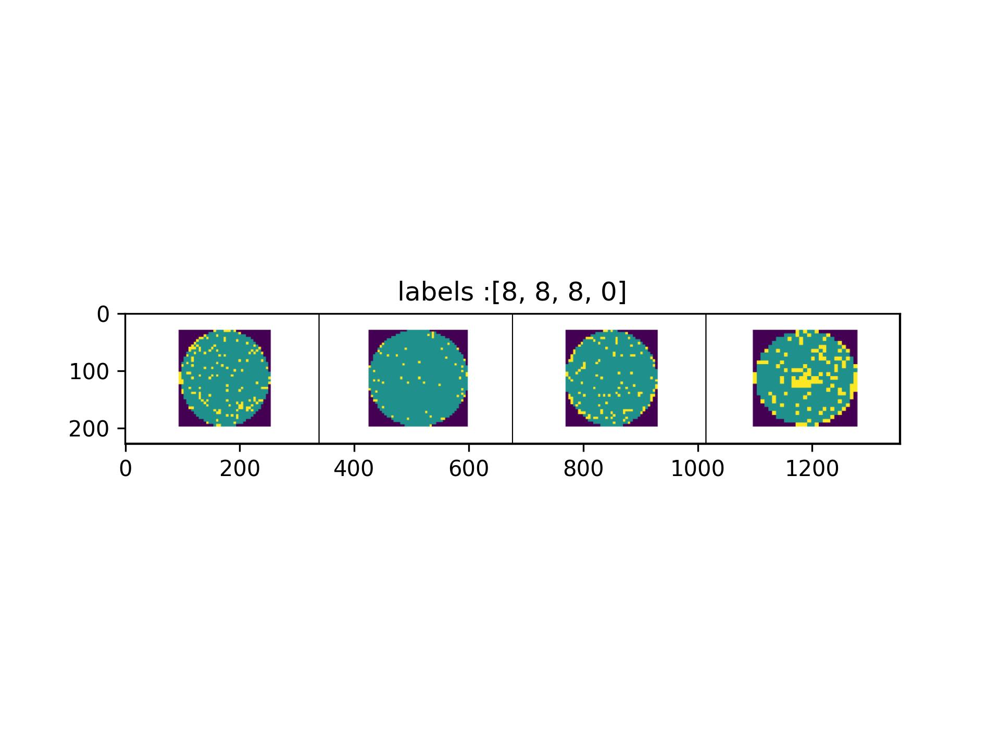

## NOTICE
- <b>용민아, 최우수상 축하한다</b> 👋  


## NOTICE-2
- <b>Docker 부분을 잘라냈습니다 🫠</b> 


<hr>

# Wafer-Classified-as-CNN

- 반도체 웨이퍼를 분류하기 위한 CNN Repo.<br>
*(Repo, Classifying Semiconductor Wafers)* 
> 인하대학교 산업경영공학과 <b>Tactics Lab.</b> / BaseLine Code for Mr.Hong :D <br>
Tactics Lab. 화이팅~ 🔥🔥🔥🔥🔥🔥


- 버전 관리 및 배포를 편하게 하기 위해서, docker 사용.<br>
*(Use docker, For ease of Vesion management & deployment)*
    - (용민이가 팀원에게 배포 편하게 하라고. :D)

- Docker Build *(default port 8080)*
    - 오류나면, --recv-keys {Your Key} 기입.
```
cd docker

docker build -t wafer-classified-as-cnn:latest . 
or 
Check -> scripts/build :D 
```

- Docker Run
```
cd .. 

docker run --name wafer-classified-as-cnn --gpus all -v $(pwd):/Wafer-Classified-as-CNN -dit --ipc=host wafer-classified-as-cnn:latest 
```

- Docker Attach
```
docker attach wafer-classified-as-cnn
```

- Create venv Environment
```
python -m venv venv
source ./venv/bin/activate
```

- Create Development Package 
    - 이 부분 오류나면, 그냥 pip instll 으로 깔아서 써 :D (requirements.cpu-dev.txt 참고.)
    - 수정하고 싶으면, setup extras 부분 check.
```
pip install -e "."
```

<hr>

- Data 준비 ? 
    - data 폴더에서 image_data(Folder)를 넣고, 아래 코드 실행!
    ```sh 
    sh scripts/split.sh
    ```

- GPU 준비 ? 
    - [config.py](src/wafer/config.py) 에서 gpu_setting 변경! 

    ``` python
    class gpu_setting:
        device = torch.device('gpu' if torch.cuda.is_available() else 'cpu')
    # 제 컴퓨터는 m1 이므로, 'mps' 로 설정 :)
    ```

- 평균과 표준편차로 이미지 normalization을 진행하는 코드? [dataset.py](src/wafer/dataset/dataset.py)에서 `get_mean_std` 확인 가능! 
- Show Grid? [showgrid.py](src/wafer/utils/showgrid.py)에서 확인 가능! 

<br>

- Early Stopping? [earlystop.py](src/wafer/utils/earlystop.py)에서 확인 가능!
- Parameters? [parameter.py](src/wafer/parameters.py)에서 확인 가능!
- ResNet34, 50, 101로 가볍게 구현. <b>ResNet34, 2epochs, Accuracy 96% 도달.</b>

```python 
print("Thank you, :D")
```